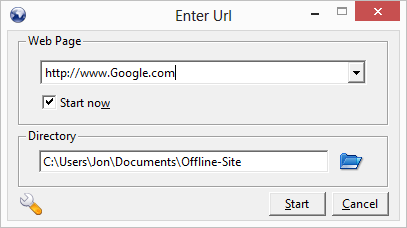
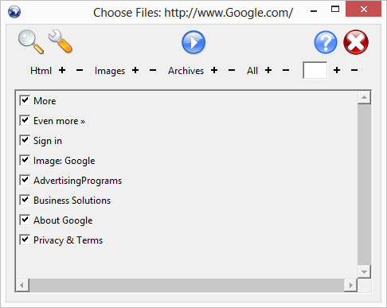
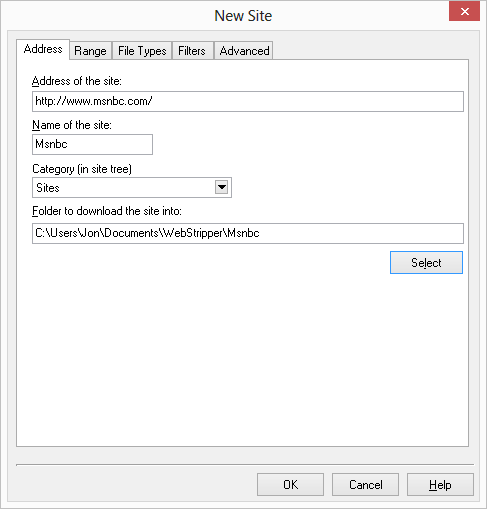
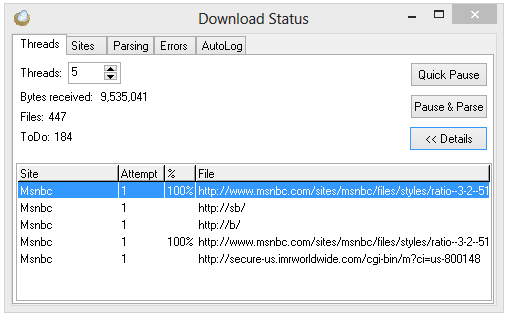
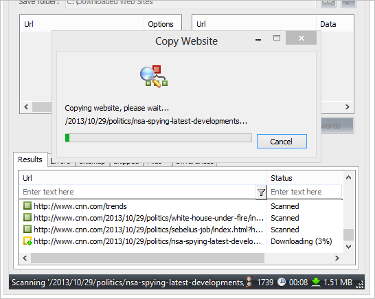
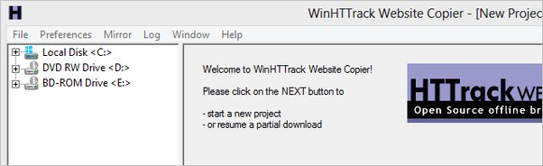
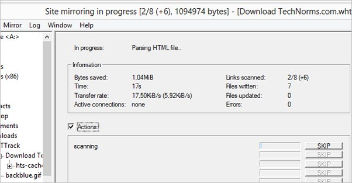

# HTTrack-Termux
HTTrack-Termux-Guide: Your one-stop guide for installing and using HTTrack on Termux. Clone websites effortlessly with easy-to-follow commands."


# HTTrack Installation Guide

Follow these steps to install and use HTTrack on Termux:

## Commands

1. Update and upgrade your Termux:
    ```bash
    apt update && apt upgrade
    ```

2. Setup storage for Termux:
    ```bash
    termux-setup-storage
    ```

3. Install HTTrack:
    ```bash
    apt install httrack
    ```

4. Alternative command to install HTTrack:
    ```bash
    pkg install httrack
    ```

5. Check HTTrack help:
    ```bash
    httrack --help
    ```

6. Clone a website (replace 'websitename' with the actual site):
    ```bash
    httrack websitename
    ```

### Quickly Install Command
  ```bash
  pkg install git && git clone https://github.com/rehan5039/HTTrack-Termux.git && cd HTTrack-Termux && chmod +x Quick_Install.sh && ./Quick_Install.sh
  ```


## Features

- **Offline Website Cloning:** HTTrack allows you to download a website to your local machine, including all its pages, images, and other assets, so you can browse it offline.

- **Customizable Styles:** The provided HTML and CSS styles are customizable. Feel free to modify them to suit your preferences or integrate the tool seamlessly into your projects.

## Additional Information

To install wget and recursively download websites using wget, you can follow these steps:

## Install wget
```
pkg install wget
```
## Recursively download websites
```
wget -r [website_url]
```
Replace `[website_url]` with the actual URL of the website you want to download recursively.

Make sure to replace `[website_url]` with the actual URL you want to download.

Usage: wget [OPTION]... [URL]...

Try `wget --help' for more options.

## step by step guide
1. **Install Termux**: If you haven't already, install the Termux app from the Google Play Store.

2. **Install Wget**: Open Termux and install Wget by running the following command:
   ```
   pkg install wget
   ```

3. **Clone Website**: Use Wget to clone the website you want. For example, to clone the website "example.com", you would run:
   ```
   wget --mirror -p --convert-links -P ./example.com http://example.com
   ```

4. **Create GitHub Repository**: Go to GitHub and create a new repository. Make sure it's empty.

5. **Initialize Git in the Cloned Directory**: Navigate to the directory where you cloned the website using Termux and initialize Git by running:
   ```
   cd example.com
   git init
   ```

6. **Add Files and Commit**: Add all the cloned files to the Git repository and commit them:
   ```
   git add .
   git commit -m "Initial commit"
   ```

7. **Push to GitHub**: Link your local repository to the GitHub repository and push the code:
   ```
   git remote add origin <GitHub repository URL>
   git push -u origin master
   ```

Replace `<GitHub repository URL>` with the URL of your GitHub repository.

That's it! Your website clone should now be in your GitHub repository.


## Additional
- To view the source of a website, use:
  ```bash
  view-source:website-link
  ```
  Example:
  ```bash
  view-source:https://github.com/rehan5039
  ```

## More Additional
To clone a website and run your local host, follow these steps:

1. Install necessary packages:
```
pkg install curl
pkg install php
```

2. Clone the website:
```
curl https://www.youtube.com > index.html
```

3. Run a local server:
```
php -S 127.0.0.1:8080
```
  
**HTTrack-Termux-Guide**:

This GitHub repository serves as a comprehensive guide and tool for utilizing HTTrack on Termux. Here's what you'll find:

- **Installation Commands**: Simple commands to update Termux, set up storage, and install HTTrack.
  
- **Usage Instructions**: Learn how to clone websites using HTTrack with step-by-step commands.

- **Features**:
  - Copy commands with a click.
  - Stylish buttons for various operations.
  - Clear and concise steps for a smooth experience.

Feel free to explore, contribute, and enhance your website cloning capabilities with HTTrack on Termux!


## Additional Command

- To specify the output directory for the mirrored website:
```bash
httrack <website-url> -O /path/to/output-directory
```

- To set the maximum number of connections:
```bash
httrack <website-url> -#N
```
Replace N with the desired number of connections.

- To set the maximum depth of the mirror (how many levels deep to follow links):
```bash
httrack <website-url> -rN
```
Replace N with the desired depth.

These commands will help you customize your website mirroring process according to your needs.


- To limit the download speed:
```bash
httrack <website-url> --limit-rate=KB/s
```
Replace KB/s with the desired download speed limit.

- To continue an interrupted download:
```bash
httrack --continue
```

- To mirror only specific file types:
```bash
httrack <website-url> '+*.filetype'
```
Replace `.filetype` with the desired file extension.


- To specify a log file for recording download progress:
```bash
httrack <website-url> -%L log.txt
```

- To mirror a website while following external links (off-site):
```bash
httrack <website-url> -%e0
```

- To mirror a website while staying within the same domain:
```bash
httrack <website-url> -%e1
```

- To set a user agent:
```bash
httrack <website-url> -%u "Mozilla/5.0 (Windows NT 10.0; Win64; x64) AppleWebKit/537.36 (KHTML, like Gecko) Chrome/91.0.4472.124 Safari/537.36"
```

- To mirror a website with depth priority (mirroring only specified depth):
```bash
httrack <website-url> -r3
```
Replace 3 with the desired depth.

- To mirror a website with specified domains:
```bash
httrack <website-url> -%A php.net/ -%A python.org/
```
Replace php.net/ and python.org/ with the desired domains.


- To mirror a website with custom timeout settings:
```bash
httrack <website-url> --timeout=30
```
Replace 30 with the desired timeout value in seconds.

- To mirror a website with custom proxy settings:
```bash
httrack <website-url> --proxy=proxy.example.com:8080
```
Replace proxy.example.com:8080 with your proxy server address and port.


- To mirror a website with custom user-defined structures:
```bash
httrack <website-url> -%P -%qC2t%Pns0u1%s%uN0%I0p3DaK0H0%kf2A25000%f#f -F "Mozilla/5.0 (Windows NT 10.0; Win64; x64) AppleWebKit/537.36 (KHTML, like Gecko) Chrome/91.0.4472.124 Safari/537.36" -%A php.net/ -%A python.org/
```

- To mirror a website with verbose logging:
```bash
httrack <website-url> -v
```

- To mirror a website with custom connection timeout:
```bash
httrack <website-url> --timeout=60
```
Replace 60 with the desired timeout value in seconds.

- To limit the depth of mirroring while following external links:
```bash
httrack <website-url> -r4 --ext-depth=2
```
Replace 4 with the maximum depth of mirroring and 2 with the maximum external depth.


- To mirror a website with custom connection retries:
```bash
httrack <website-url> --retries=5
```
Replace 5 with the desired number of retries.

- To mirror a website while ignoring robots.txt rules:
```bash
httrack <website-url> -%k
```

- To mirror a website with custom user agent:
```bash
httrack <website-url> -%u "Mozilla/5.0 (Windows NT 10.0; Win64; x64) AppleWebKit/537.36 (KHTML, like Gecko) Chrome/91.0.4472.124 Safari/537.36"
```

- To mirror a website with custom download bandwidth:
```bash
httrack <website-url> --max-rate=100K
```
Replace 100K with the desired maximum download rate.

- To mirror a website with custom limits on the number of connections:
```bash
httrack <website-url> --max-connections=5
```
Replace 5 with the desired maximum number of connections.

- To mirror a website while preserving the directory structure:
```bash
httrack <website-url> -%c2
```

#### Don't Use
  ```bash
  pkg install git && git clone https://github.com/rehan5039/HTTrack-Termux.git && cd HTTrack-Termux && chmod +x install_httrack.sh && ./install_httrack.sh
  ```

# HTTrack: Website Mirror Utility

## Description
HTTrack is a versatile website mirror utility designed to facilitate downloading entire websites from the internet to a local directory. It recursively builds all structures, retrieves HTML, images, and other files from the server to your computer. The utility ensures that links are rebuilt relatively, enabling seamless browsing of the local site with any browser. It supports mirroring multiple sites concurrently, allowing easy navigation between them. Additionally, HTTrack offers features to update existing mirror sites and resume interrupted downloads. The robot's behavior is fully configurable and includes integrated help documentation.

## Features
- Recursively downloads entire websites
- Retains directory structure
- Retrieves HTML, images, and other files
- Builds links relatively for local browsing
- Supports mirroring multiple sites simultaneously
- Updates existing mirror sites
- Resumes interrupted downloads
- Configurable robot behavior
- Integrated help documentation

# HTTrack Installation Guide All Operating System

## Windows

1. Visit the [HTTrack download page](https://github.com/rehan5039/HTTrack-Termux/releases/download/HTTrack/httrack-3.49.2.exe).
2. Download the Windows version (`WinHTTrack`).
3. Run the installer and follow the on-screen instructions.

## macOS

You can install HTTrack using Homebrew:

1. If you haven't installed Homebrew, follow the instructions on the [Homebrew website](https://brew.sh/).
2. Open a terminal and run the following command:
   ```sh
   brew install httrack
   ```

## Linux

### Debian/Ubuntu-based distributions:

1. Open a terminal and run the following commands:
   ```sh
   sudo apt update
   sudo apt install httrack
   ```

### Fedora:

1. Open a terminal and run the following command:
   ```sh
   sudo dnf install httrack
   ```
### Arch Linux:

1. Open a terminal and run the following command:
   ```sh
   sudo pacman -S httrack
   ```

### Other distributions:

Refer to your distribution's package manager documentation to install HTTrack.

## Verification

To verify that HTTrack is installed correctly, open a terminal or command prompt and run:
```sh
httrack --version
```

# Download Website
The programs mentioned below can serve this purpose very well. The options are straightforward enough that you can begin downloading an entire website in just a couple of minutes.

## Getleft




## PageNest






## Cyotek Webcopy




## HTTracks






Sure! Here's the detailed **HTTrack-Termux** guide translated into **English** and aligned for better clarity and structure.

---

### **HTTrack Usage Guide for Termux (Android) and Linux**

#### **1. Installing HTTrack on Termux (Android)**

To install HTTrack on **Termux (Android)**, follow these simple steps:

##### **Steps for Installing HTTrack on Termux:**

1. **Update Termux Packages:**
   First, update the packages in Termux:
   ```bash
   apt update && apt upgrade
   ```

2. **Setup Termux Storage:**
   If you need access to external storage, run this command:
   ```bash
   termux-setup-storage
   ```

3. **Install HTTrack:**
   To install HTTrack:
   ```bash
   apt install httrack
   ```

4. **Alternative Install Command:**
   If there are issues with `apt`, you can also try using `pkg`:
   ```bash
   pkg install httrack
   ```

5. **Verify Installation:**
   After installation, check if HTTrack is installed correctly by running:
   ```bash
   httrack --help
   ```

---

#### **2. HTTrack Usage in Termux (Android)**

You can run **HTTrack** in Termux with the following basic and advanced commands to **download websites**, **customize settings**, and **mirror content**.

##### **Basic HTTrack Commands for Termux (Android):**

1. **Download a Website (Basic Command):**
   To simply mirror a website:
   ```bash
   httrack http://example.com
   ```

2. **Download Website to a Specific Directory:**
   To download a website to a custom directory:
   ```bash
   httrack http://example.com -O /storage/emulated/0/my-website
   ```
   Here, `-O` specifies the output path.

3. **Limit the Depth of Download (Number of Levels to Follow Links):**
   To limit the depth of crawling (e.g., 3 levels deep):
   ```bash
   httrack http://example.com -r3
   ```

4. **Set Maximum Connections (Speed Up Downloads):**
   To increase download speed by setting a maximum number of simultaneous connections:
   ```bash
   httrack http://example.com -#5
   ```

5. **Limit Download Speed:**
   To limit the download speed:
   ```bash
   httrack http://example.com --limit-rate=100K
   ```

6. **Resume Interrupted Downloads:**
   If a download was interrupted, resume it with:
   ```bash
   httrack --continue
   ```

---

#### **3. HTTrack Usage in Linux (Ubuntu/Debian)**

Running **HTTrack** on **Linux (Ubuntu/Debian)** is easy and straightforward since it can be installed directly via the package manager.

##### **Steps for Installing HTTrack on Linux (Ubuntu/Debian):**

1. **Install HTTrack Using `apt`:**
   To install HTTrack using `apt` package manager:
   ```bash
   sudo apt update
   sudo apt install httrack
   ```

2. **Install HTTrack Using Snap (For newer versions):**
   If Snap is installed on your system, use the following command:
   ```bash
   sudo snap install httrack
   ```

3. **Verify Installation:**
   To check the version of HTTrack:
   ```bash
   httrack --version
   ```

---

#### **4. HTTrack Usage on Linux (Advanced Commands)**

On Linux, you can use **advanced features** to customize the download process more precisely.

##### **1. Clone a Website:**
To clone a website:
```bash
httrack http://example.com
```

##### **2. Download Website to a Specific Directory:**
To save the website to a custom directory:
```bash
httrack http://example.com -O /home/user/my-website
```

##### **3. Download with Specific File Types:**
To download only specific file types (e.g., images), use:
```bash
httrack http://example.com '+*.jpg' '+*.png' '-*.mp4'
```
Here, `+` means include, and `-` means exclude specific file types.

##### **4. Set Maximum Number of Connections:**
To limit the number of concurrent connections:
```bash
httrack http://example.com -#4
```

##### **5. Set Maximum Depth for Crawling:**
To limit the crawling depth:
```bash
httrack http://example.com -r2
```

##### **6. Follow External Links (Mirror External Websites):**
To include external links:
```bash
httrack http://example.com -%e0
```

##### **7. Log Download Progress:**
To log the download process to a file:
```bash
httrack http://example.com -%L log.txt
```

##### **8. Change User-Agent:**
To set a custom User-Agent string:
```bash
httrack http://example.com -%u "Mozilla/5.0 (Windows NT 10.0; Win64; x64) AppleWebKit/537.36 (KHTML, like Gecko) Chrome/91.0.4472.124 Safari/537.36"
```

##### **9. Mirror Websites Without Following `robots.txt`:**
To ignore the `robots.txt` file:
```bash
httrack http://example.com -%k
```

##### **10. Specify Proxy Settings:**
To use a proxy server:
```bash
httrack http://example.com --proxy=proxy.example.com:8080
```

##### **11. Set Timeout for Connections:**
To set a connection timeout:
```bash
httrack http://example.com --timeout=30
```

##### **12. Resume Download from Interrupted Point:**
To resume a download that was interrupted:
```bash
httrack --continue
```

---

#### **5. Additional Tools for Website Cloning:**

1. **Using Wget for Website Cloning (Linux/Termux):**
   Another popular tool for website cloning is **Wget**. Here’s how you can use it:
   ```bash
   pkg install wget  # Install wget in Termux
   sudo apt install wget  # Install wget in Linux
   wget --mirror -p --convert-links -P ./example.com http://example.com
   ```

2. **Using cURL for Website Download (Linux/Termux):**
   You can also use **cURL** to download a website:
   ```bash
   curl http://example.com > index.html
   ```

---

### **Advanced HTTrack Commands**

#### **1. Exclude Specific File Types**

To exclude specific file types (like images or videos) from downloading, use the **`-X`** option.

**Example:**
Exclude `.jpg` and `.png` files:
```bash
httrack http://example.com -X '*.jpg' -X '*.png'
```

---

#### **2. Download Only Specific Files**

To download only specific types of files (e.g., `.html` files), use the **`+`** sign.

**Example:**
Download only `.html` files:
```bash
httrack http://example.com +*.html
```

---

#### **3. Set Maximum Download Speed**

To limit the download speed, use the **`--max-rate`** option.

**Example:**
Limit download speed to 500 KB/s:
```bash
httrack http://example.com --max-rate=500K
```

---

#### **4. Set Download Retry Limit**

To set the number of retries in case of errors or interruptions, use the **`--retries`** option.

**Example:**
Set retry attempts to 3:
```bash
httrack http://example.com --retries=3
```

---

#### **5. Ignore SSL Certificate Warnings**

If the website is secure (HTTPS) and SSL certificate errors occur, use the **`--no-check-certificate`** option to ignore SSL warnings.

**Example:**
Ignore SSL certificate verification:
```bash
httrack http://example.com --no-check-certificate
```

---

#### **6. Set User-Agent String**

To set a custom User-Agent string (e.g., simulating Chrome or Firefox), use the **`-%u`** option.

**Example:**
Set a custom User-Agent string (simulating Chrome):
```bash
httrack http://example.com -%u "Mozilla/5.0 (Windows NT 10.0; Win64; x64) AppleWebKit/537.36 (KHTML, like Gecko) Chrome/91.0.4472.124 Safari/537.36"
```

---

#### **7. Mirror a Website and Exclude Specific Directory**

To exclude certain directories (like `/images`) from the mirror, use the **`-X`** option.

**Example:**
Exclude `/images` directory from download:
```bash
httrack http://example.com -X /images
```

---

#### **8. Download Specific Subpages from Website**

To mirror only specific subpages (e.g., `/about` and `/contact`), use the **`+`** sign.

**Example:**
Download only the `/about` and `/contact` subpages:
```bash
httrack http://example.com +*/about +*/contact
```

---

#### **9. Mirror Website with External Links and Limit Depth**

To mirror the website and include external links while limiting the crawl depth, use the **`-r`** option and **`-%e0`**.

**Example:**
Mirror a website and include external links with a

 depth limit of 3:
```bash
httrack http://example.com -r3 -%e0
```

---

#### **10. Use Proxy Server for Downloading**

To specify a proxy server for the download, use the **`--proxy`** option.

**Example:**
Use a proxy server:
```bash
httrack http://example.com --proxy=proxy.example.com:8080
```

---

#### **11. Download Website with Specific File Size Limits**

To set a file size limit while downloading, use the **`--max-size`** option.

**Example:**
Limit download file size to 10MB:
```bash
httrack http://example.com --max-size=10M
```

---

#### **12. Limit Number of Links to Follow**

To restrict the number of links HTTrack follows, use the **`-r`** and **`-n`** options.

**Example:**
Follow only 5 links from the website:
```bash
httrack http://example.com -r3 -n5
```

---

#### **13. Save Output to a Log File**

To log the download process to a file, use the **`-%L`** option.

**Example:**
Save log to `download.log`:
```bash
httrack http://example.com -%L download.log
```

---

#### **14. Download a Website and Create an Offline Mirror**

To create an offline mirror of a website with relative links, use **`--convert-links`**.

**Example:**
Download website with relative links:
```bash
httrack http://example.com --convert-links
```

---

#### **15. Download Website with Custom Timeout Settings**

To set a timeout for connections, use the **`--timeout`** option.

**Example:**
Set timeout to 60 seconds:
```bash
httrack http://example.com --timeout=60
```

---

#### **16. Mirror Website with Specific File Extensions**

To download only certain file extensions (like `.pdf` or `.jpg`), use the **`+`** sign.

**Example:**
Download only `.pdf` and `.jpg` files:
```bash
httrack http://example.com +*.pdf +*.jpg
```

---
### **17. Download Website with Specific Date/Time Range**

You can use the **`--date`** option to download content only within a specific date or time range.

**Example:**
Download content from the past 30 days:
```bash
httrack http://example.com --date="2023-10-01..2023-10-31"
```

---

### **18. Download Files and Preserve File Attributes**

If you need to preserve file timestamps (like creation and modification times), use the **`--preserve`** option.

**Example:**
Preserve file attributes:
```bash
httrack http://example.com --preserve
```

---

### **19. Mirror Website Without Downloading Images**

You can choose not to download images, which can be useful if you are only interested in text content and pages.

**Example:**
Exclude images from the download:
```bash
httrack http://example.com -X "*.jpg" -X "*.png" -X "*.gif"
```

---

### **20. Download Website with Custom HTTP Headers**

To specify custom HTTP headers during the website download (for example, simulating a mobile browser), use the **`--header`** option.

**Example:**
Send a custom `User-Agent` and `Accept-Language` header:
```bash
httrack http://example.com --header "User-Agent: Mozilla/5.0 (Android; Mobile; rv:40.0) Gecko/40.0 Firefox/40.0" --header "Accept-Language: en-US"
```

---

### **21. Avoid Downloading External Content (Limit to Internal Pages)**

To avoid downloading external content (like images, stylesheets, or scripts hosted on other servers), use the **`-%e0`** option.

**Example:**
Download only internal content (no external links):
```bash
httrack http://example.com -%e0
```

---

### **22. Download Website and Handle Cookies**

You can manage cookies while downloading a website, either by passing your own cookies file or letting HTTrack handle cookies automatically.

**Example:**
Use cookies from a file:
```bash
httrack http://example.com --cookies-file=./cookies.txt
```

---

### **23. Limit the Number of Simultaneous Connections for Performance**

To avoid overloading your network or the server you're downloading from, you can limit the number of simultaneous connections with **`-#`**.

**Example:**
Limit the number of simultaneous connections to 2:
```bash
httrack http://example.com -#2
```

---

### **24. Download a Website Using a Username and Password (Authentication)**

If the website requires authentication (username and password), you can pass these credentials using the **`--auth`** option.

**Example:**
Download a website that requires authentication:
```bash
httrack http://example.com --auth="username:password"
```

---

### **25. Download Website and Exclude Certain Paths**

You can exclude specific paths or directories from your download using **`-%X`**.

**Example:**
Exclude the `/private` directory from download:
```bash
httrack http://example.com -%X /private
```

---

### **26. Use HTTP/2 for Faster Download**

HTTrack allows you to use **HTTP/2** to improve download speeds by using multiple streams. You can enable HTTP/2 support by using the **`--http2`** option.

**Example:**
Enable HTTP/2 for faster downloads:
```bash
httrack http://example.com --http2
```

---

### **27. Set Download Priority for Certain File Types**

You can prioritize certain file types to be downloaded first (such as `.html` files), by setting priorities with the **`--priority`** option.

**Example:**
Prioritize `.html` files to download first:
```bash
httrack http://example.com --priority="*.html"
```

---

### **28. Use Recursive Download for Nested Links**

For nested content (e.g., pages linking to other pages), you can enable **recursive downloading** to follow all linked content within the website using the **`-r`** option.

**Example:**
Download recursively with a depth limit of 5:
```bash
httrack http://example.com -r5
```

---

### **29. Download Website and Filter Content by Size**

To filter out very large files (such as videos), you can specify size limits using **`--max-size`**.

**Example:**
Download files up to 5MB in size:
```bash
httrack http://example.com --max-size=5M
```

---

### **30. Download Website with a Specific Domain**

Sometimes you might want to download only the content hosted on a particular domain, ignoring other external resources. Use **`--domain`** to specify which domains should be included.

**Example:**
Download only content from `example.com`:
```bash
httrack http://example.com --domain=example.com
```

---

### **31. Use Cookies and Sessions for Logged-in Content**

If you're logged into a site, you can pass the current session's cookies or a specific session cookie file.

**Example:**
Use a session cookie file for logged-in content:
```bash
httrack http://example.com --cookies-file=session_cookies.txt
```

---

### **32. Use "Mirror" Mode to Update Existing Mirror**

If you already have a partial website downloaded and want to update it, you can use **mirror mode** to download only the changed content. This helps save time and bandwidth.

**Example:**
Update an existing mirror:
```bash
httrack http://example.com --mirror
```

---

### **33. Use FTP for Downloading Websites**

HTTrack can also be used to download websites from **FTP servers** by specifying the FTP URL.

**Example:**
Download from an FTP server:
```bash
httrack ftp://ftp.example.com/
```

---

### **34. Set Maximum Retry Limit on Failed Downloads**

In case of failures or timeouts, you can limit the number of retry attempts with the **`--max-retries`** option.

**Example:**
Set retry attempts to 5:
```bash
httrack http://example.com --max-retries=5
```

---

### **35. Download Content Using a Specific Referer Header**

Sometimes you may need to simulate a referrer to download certain content. You can use **`--referer`** to specify a custom referrer header.

**Example:**
Use a custom referer header:
```bash
httrack http://example.com --referer="http://example.com/referer-page"
```

---

### **36. Change the File Extension for Downloaded Files**

You can change the file extension of downloaded files if required by using **`--convert`**.

**Example:**
Convert `.html` files to `.txt`:
```bash
httrack http://example.com --convert ".html=.txt"
```

---

### **37. Avoid Redirect Loops During Download**

If you're concerned about potential redirect loops during downloading, use the **`--no-redirects`** option.

**Example:**
Avoid redirect loops:
```bash
httrack http://example.com --no-redirects
```

---

### **38. Download Website and Save in a Compressed Format**

You can compress the output into a `.tar.gz` or `.zip` file for easier storage and sharing by using tools in conjunction with HTTrack.

**Example:**
Compress the website content into a `.tar.gz` file:
```bash
httrack http://example.com -O /path/to/output && tar -czf website_backup.tar.gz /path/to/output
```

---

### **39. Mirror a Website and Keep It in Sync**

To mirror a website and keep it updated regularly (e.g., every 24 hours), you can schedule the command in **Cron (Linux)** or use Termux's **`at`** command to set the timing.

**Example:**
Set a cron job to update every 24 hours:
```bash
crontab -e
# Add the following line to your crontab:
0 0 * * * httrack http://example.com --mirror
```

---

### **40. Limit Domain Depth**

If you're worried about following links too deeply across a domain, you can limit the depth of crawling within the domain.

**Example:**
Limit domain depth to 2:
```bash
httrack http://example.com -D2
```

---

### **41. Save Downloaded Files with Original File Names**

If you want to maintain the original file names (and avoid automatic renaming), use **`--no-renaming`**.

**Example:**
Save files with their original names:
```bash
httrack http://example.com --no-renaming
```

---

### **42. Use Custom File Filters (Include and Exclude)**

To filter files more specifically, use the **`+`** (include) and **`-`** (exclude) options together for advanced filtering.

**Example:**
Include only `.html` and `.css` files but exclude `.jpg` files:
```bash
httrack http://example.com +*.html +*.css -*.jpg
```


---

### **43. Download a Website and Automatically Update Existing Content**

HTTrack offers an option to automatically check for updates on an already downloaded website and download only the changes or new content. This can save bandwidth and time, especially for large websites where only a small amount of content is updated regularly.

You can use the **`--update`** option to enable this feature.

**Example:**
Automatically update the downloaded website with new or modified content:
```bash
httrack http://example.com --update
```

**Explanation:**
- **`--update`**: This option checks for changes on the website and only downloads the new or updated files. It won't re-download the entire website from scratch, making the process more efficient and faster for ongoing mirroring.

---

### **When to Use This Command?**
- If you are monitoring a website that changes frequently (e.g., blogs, news sites, or forums).
- When you want to keep a local copy of the website updated automatically without downloading the same content again.

---


---

### **45. Download a Website Using a Specific Hostname**

If you want to mirror a website but use a different hostname for the target domain (e.g., for testing or local development purposes), you can specify a **custom hostname** using the **`--hostname`** option.

**Example:**
Download the website using a specific hostname:
```bash
httrack http://example.com --hostname=localhost
```

**Explanation:**
- **`--hostname=localhost`**: This tells HTTrack to mirror the website as if it's hosted on "localhost" instead of the original domain.

---

### **46. Automatically Accept All Certificates (Including Invalid)**

If you're downloading from a website with an invalid or self-signed SSL certificate, HTTrack can be configured to ignore SSL certificate errors and accept them automatically.

**Example:**
Automatically accept all SSL certificates:
```bash
httrack http://example.com --ssl-accept-all
```

**Explanation:**
- **`--ssl-accept-all`**: This bypasses SSL certificate validation and accepts all certificates, even if they're invalid.

---

### **47. Use a Random User-Agent String for Each Connection**

For anti-bot measures, websites may track the User-Agent. By using a **random User-Agent** for each connection, you can simulate browsing by different users.

**Example:**
Use a random User-Agent for each request:
```bash
httrack http://example.com --user-agent=random
```

**Explanation:**
- **`--user-agent=random`**: This instructs HTTrack to randomly choose different User-Agent strings for each connection, helping to avoid detection as a bot.

---

### **48. Set Download Limit Based on File Size (Max File Size)**

If you're downloading a website and want to limit the maximum size of files being downloaded, use the **`--max-size`** option to set a file size limit for the download.

**Example:**
Set a maximum file size of **5 MB** per file:
```bash
httrack http://example.com --max-size=5M
```

**Explanation:**
- **`--max-size=5M`**: Files larger than 5MB will not be downloaded. You can use **M** for MB or **G** for GB.

---

### **49. Mirror a Website with Only Specific Subdirectories**

If you want to download a website but only from specific subdirectories (e.g., only the `/blog` subdirectory), you can specify these subdirectories in your command.

**Example:**
Download only the `/blog` and `/news` subdirectories:
```bash
httrack http://example.com +*/blog +*/news
```

**Explanation:**
- **`+*/blog`**: Includes all pages under the `/blog` directory.
- **`+*/news`**: Includes all pages under the `/news` directory.

---

### **50. Download Only Pages with Specific URL Parameters**

You may want to download only specific pages of a website that contain certain parameters in the URL (e.g., query strings).

**Example:**
Download only URLs containing `?id=`:
```bash
httrack http://example.com '+*?id=*'
```

**Explanation:**
- **`'+*?id=*'`**: Only URLs containing `?id=` in their path will be downloaded.

---

### **51. Limit Download to Files with Specific Extensions**

To download only certain types of files (e.g., `.html`, `.css`, `.js`), you can specify the file extensions you want to include.

**Example:**
Download only `.html`, `.css`, and `.js` files:
```bash
httrack http://example.com +*.html +*.css +*.js
```

**Explanation:**
- **`+*.html`**: Includes all `.html` files.
- **`+*.css`**: Includes all `.css` files.
- **`+*.js`**: Includes all `.js` files.

---

### **52. Mirror a Website with External Resources (Like Images, Videos, etc.)**

To download external resources such as images, videos, or files linked from other domains, use the **`-%e0`** option.

**Example:**
Mirror a website including all external resources:
```bash
httrack http://example.com -%e0
```

**Explanation:**
- **`-%e0`**: This option mirrors external links (i.e., links to other domains) as well.

---

### **53. Download Website and Save Files to a Specific Directory**

You can specify a custom output directory for the mirrored files, allowing you to organize them neatly.

**Example:**
Download and save the website to `/storage/emulated/0/website`:
```bash
httrack http://example.com -O /storage/emulated/0/website
```

**Explanation:**
- **`-O /storage/emulated/0/website`**: This sets the download output directory.

---

### **54. Download a Website with Authentication (HTTP Auth)**

If the website you're downloading requires authentication, use the **`--auth-user`** and **`--auth-pass`** options to provide the username and password.

**Example:**
Download a website that requires HTTP authentication:
```bash
httrack http://example.com --auth-user=admin --auth-pass=admin123
```

**Explanation:**
- **`--auth-user=admin`**: Specifies the username for HTTP authentication.
- **`--auth-pass=admin123`**: Specifies the password for HTTP authentication.

---

### **55. Download Only Changed Pages (Mirror Updates)**

HTTrack can download only pages that have been updated since the last download. This can be useful for keeping a website mirror up to date without re-downloading unchanged files.

**Example:**
Download only the changed files from the website:
```bash
httrack http://example.com --mirror-updates
```

**Explanation:**
- **`--mirror-updates`**: This option tells HTTrack to only download new or modified pages since the last run.

---

### **56. Use a Specific Proxy Server**

If you need to route your downloads through a proxy server for privacy or bypassing restrictions, use the **`--proxy`** option.

**Example:**
Use a proxy server for the download:
```bash
httrack http://example.com --proxy=proxy.example.com:8080
```

**Explanation:**
- **`--proxy=proxy.example.com:8080`**: Specifies the proxy server and port to use during the download.

---

### **57. Disable Host Headers for Privacy**

To avoid sending the `Host` header that can reveal the exact domain you're downloading, use the **`--no-host-headers`** option.

**Example:**
Disable host headers:
```bash
httrack http://example.com --no-host-headers
```

**Explanation:**
- **`--no-host-headers`**: Disables the inclusion of the `Host` header in requests, adding an extra layer of privacy.

---

### **58. Download Website with SSL Support**

If you want to download a website using HTTPS, but the site has issues with SSL certificates, you can bypass the SSL certificate checks using the **`--no-check-certificate`** option.

**Example:**
Download a website with SSL but without verifying certificates:
```bash
httrack http://example.com --no-check-certificate
```

**Explanation:**
- **`--no-check-certificate`**: This option ignores SSL certificate verification, allowing the download of sites with invalid or self-signed SSL certificates.

---

### **59. Limit the Maximum Number of Connections**

If you want to control the number of simultaneous connections used during the download (for throttling purposes or to reduce load on the website), use the **`-#`** option to set a connection limit.

**Example:**
Limit the number of simultaneous connections to **4**:
```bash
httrack http://example.com -#4
```

**Explanation:**
- **`-#4`**: This limits the number of simultaneous connections to 4. Adjust the number based on your network capacity or desired speed.

---

### **60. Perform a Test Dry Run**

If you want to check the website's structure and what HTTrack will attempt to download, but don't actually want to download the files, use the **`--dry-run`** option.

**Example:**
Perform a dry run:
```bash
httrack http://example.com --dry-run
```

**Explanation:**
- **`--dry-run`**: This runs the process and shows the actions HTTrack would take, but without actually downloading any files. It's useful for testing and reviewing.

---


---

### **61. Download a Website with a Specific Download Mode**

HTTrack supports different modes for downloading websites. One of the most useful is the **"batch" mode**, which allows for downloading multiple sites in a queue.

**Example:**
Download multiple websites in a batch mode:
```bash
httrack -i0 http://example.com http://anotherexample.com
```

**Explanation:**
- **`-i0`**: This starts batch mode, which processes multiple URLs in a sequence.

---

### **62. Adjust the Depth of Link Crawling (Maximum Recursive Depth)**

To control how deep HTTrack should crawl into a website’s structure (i.e., the number of links to follow from the initial page), you can set the **maximum depth** with the **`-r`** option.

**Example:**
Limit the recursion depth to **3** levels:
```bash
httrack http://example.com -r3
```

**Explanation:**
- **`-r3`**: This will follow links up to 3 levels deep. Decrease the number for a shallower crawl or increase for a deeper crawl.

---

### **63. Download Website Using a Specific Referer**

Some websites may block access based on the **Referer** header, which is sent by the browser to indicate the previous page the request came from. You can set a custom **Referer** using the **`--referer`** option.

**Example:**
Download a website and set the referer:
```bash
httrack http://example.com --referer=http://example.com/startpage
```

**Explanation:**
- **`--referer=http://example.com/startpage`**: This sets the `Referer` header to `startpage`, simulating the request as if it came from that page.

---

### **64. Download Website with Specific Time Limit**

If you want to limit how long HTTrack should spend on downloading a website, use the **`--timeout`** option to set a time limit for the operation.

**Example:**
Set a timeout of **60 seconds** for each request:
```bash
httrack http://example.com --timeout=60
```

**Explanation:**
- **`--timeout=60`**: This tells HTTrack to limit the time spent on each HTTP request to 60 seconds.

---

### **65. Download Website and Include Only Pages with Specific Keywords**

If you're interested in only certain parts of a website that include specific keywords in the URL or page content, you can filter the download using the **`+`** and **`-`** options for keywords.

**Example:**
Download only pages with the word "blog" in the URL:
```bash
httrack http://example.com '+*/blog/*'
```

**Explanation:**
- **`'+*/blog/*'`**: This will only download pages with `blog` in their URL, such as `example.com/blog/`, `example.com/blog/post1`, etc.

---

### **66. Exclude Links with Specific Keywords**

If you need to exclude certain parts of the website based on specific keywords or paths (e.g., avoiding links that contain `search` or `login`), you can use the **`-`** sign to filter them out.

**Example:**
Exclude any pages with "search" or "login" in the URL:
```bash
httrack http://example.com '-*/search/*' '-*/login/*'
```

**Explanation:**
- **`'-*/search/*'`**: This excludes any pages with `search` in their URL path.
- **`'-*/login/*'`**: Similarly, this excludes any pages with `login` in their URL path.

---

### **67. Download Website with Specific Maximum File Size Limit (MB)**

If you want to limit the maximum size of the files being downloaded from a website, you can use the **`--max-size`** option to specify the maximum file size (in megabytes or gigabytes).

**Example:**
Limit downloaded files to **10 MB**:
```bash
httrack http://example.com --max-size=10M
```

**Explanation:**
- **`--max-size=10M`**: This limits the size of the downloaded files to 10 MB. You can use **M** for megabytes or **G** for gigabytes.

---

### **68. Set the Maximum Number of Errors Allowed**

HTTrack allows you to set a limit for the number of download errors (e.g., timeouts, page not found) before it stops the operation. You can use the **`--max-errors`** option to specify this limit.

**Example:**
Set a limit of **5 errors** before stopping the download:
```bash
httrack http://example.com --max-errors=5
```

**Explanation:**
- **`--max-errors=5`**: If HTTrack encounters 5 errors during the download, it will stop automatically.

---

### **69. Limit the Maximum Number of Connections per Host**

To manage bandwidth usage or avoid overloading the website, you can limit the number of simultaneous connections to each host (server) with the **`-#`** option.

**Example:**
Limit the number of simultaneous connections per host to **2**:
```bash
httrack http://example.com -#2
```

**Explanation:**
- **`-#2`**: This limits the number of simultaneous connections to 2 for each individual host (server) that HTTrack is accessing.

---

### **70. Download a Website with SSL Support (HTTPS)**

If you want to mirror a website over SSL (HTTPS), and the website is using a secure connection, you can explicitly tell HTTrack to handle SSL connections. You can use the **`--ssl`** option for SSL-enabled websites.

**Example:**
Download a website over SSL:
```bash
httrack https://example.com --ssl
```

**Explanation:**
- **`--ssl`**: This tells HTTrack to handle connections over SSL (secure connections), ensuring it can mirror websites hosted on HTTPS.

---


---

### **71. Download Website with Custom File Types**

If you want to download only specific file types from a website, you can use the **`+`** and **`-`** options to include or exclude certain file extensions. This is particularly useful if you only need certain types of content, such as images or documents.

**Example:**
Download only **images** and **PDF files**:
```bash
httrack http://example.com +*.jpg +*.png +*.pdf
```

**Explanation:**
- **`+*.jpg`**, **`+*.png`**, and **`+*.pdf`**: These options include only the specified file types (JPEG, PNG, and PDF files).

---

### **72. Exclude URLs Matching a Specific Pattern**

If you need to exclude URLs matching a specific pattern (for example, excluding all URLs that contain the word "private" or any URLs with a query string), you can use the **`-`** symbol followed by a regular expression or wildcard.

**Example:**
Exclude any URLs that contain "private" or "search" in the URL:
```bash
httrack http://example.com '-*private*' '-*search*'
```

**Explanation:**
- **`'-*private*'`**: Excludes any URL containing the string "private".
- **`'-*search*'`**: Excludes any URL containing the string "search".

---

### **73. Download Website and Limit Download by Date Range**

If you want to download only content that was modified during a specific date range, you can use the **`--date`** option. This will filter content by the last modification date.

**Example:**
Download only pages modified between **2020-01-01** and **2020-12-31**:
```bash
httrack http://example.com --date="2020-01-01,2020-12-31"
```

**Explanation:**
- **`--date="2020-01-01,2020-12-31"`**: This downloads pages that were last modified within the specified date range.

---

### **74. Resume Interrupted Download Using Session File**

HTTrack allows you to resume a download that was previously interrupted by using a **session file**. This file stores all the progress, so when you run HTTrack again, it picks up where it left off.

**Example:**
Resume a download using a session file:
```bash
httrack --continue --path=/path/to/session/file
```

**Explanation:**
- **`--continue`**: Tells HTTrack to resume an interrupted download.
- **`--path=/path/to/session/file`**: Specifies the session file used for resuming the download.

---

### **75. Download Website and Set User-Agent for Specific Device**

Sometimes, you might want to simulate a different device (like a mobile phone or tablet) when downloading a website. You can set a custom **User-Agent** string to mimic any browser or device type.

**Example:**
Simulate a **mobile device** using the User-Agent for Chrome on Android:
```bash
httrack http://example.com -%u "Mozilla/5.0 (Linux; Android 10; Pixel 4) AppleWebKit/537.36 (KHTML, like Gecko) Chrome/91.0.4472.124 Mobile Safari/537.36"
```

**Explanation:**
- **`-%u`**: Sets a custom **User-Agent** header. This simulates a mobile device (Pixel 4 running Android 10 with Chrome 91).

---

### **76. Download Website and Ignore SSL Verification (Ignore Certificate Warnings)**

Sometimes, HTTrack might fail to download a website if there is an SSL certificate warning or error (e.g., self-signed certificates). In such cases, you can use the **`--no-check-certificate`** option to bypass these SSL issues.

**Example:**
Ignore SSL certificate verification and proceed with the download:
```bash
httrack http://example.com --no-check-certificate
```

**Explanation:**
- **`--no-check-certificate`**: This allows HTTrack to ignore any SSL certificate warnings or errors and proceed with the download.

---

### **77. Set Custom Headers for HTTP Requests**

If you want to send custom headers along with your HTTP requests (for example, for tracking or to bypass restrictions), you can use the **`--header`** option to set specific HTTP headers.

**Example:**
Add a custom header to the requests:
```bash
httrack http://example.com --header="X-Custom-Header: myvalue"
```

**Explanation:**
- **`--header="X-Custom-Header: myvalue"`**: This sets a custom header in the HTTP request (e.g., a custom authentication or tracking header).

---

### **78. Download Website and Only Include HTML Files**

If you're only interested in downloading HTML files from a website (excluding all other types of media like images, CSS, or JavaScript), you can filter the download using the **`+`** sign to specify only HTML files.

**Example:**
Download only **HTML** files:
```bash
httrack http://example.com +*.html
```

**Explanation:**
- **`+*.html`**: This tells HTTrack to include only files with the `.html` extension.

---

### **79. Download Website with Proxy Server**

If you need to route your traffic through a proxy server (for privacy or access purposes), HTTrack allows you to configure a **proxy** server.

**Example:**
Download a website using a **proxy server**:
```bash
httrack http://example.com --proxy=proxy.example.com:8080
```

**Explanation:**
- **`--proxy=proxy.example.com:8080`**: This specifies the proxy server and port (replace with your own proxy address and port).

---

### **80. Use Multiple Mirrors for Downloading**

HTTrack can use multiple mirrors or different servers to download a website, which can help speed up the process if you have access to different sources or servers for the same website content.

**Example:**
Use **two mirrors** to download a website:
```bash
httrack http://example.com --mirror1=http://mirror1.example.com --mirror2=http://mirror2.example.com
```

**Explanation:**
- **`--mirror1`** and **`--mirror2`**: These options specify alternative mirrors (or sources) from which HTTrack can download the content, which can help speed up the process.

---


---

### **81. Limit Download Speed by Connection**

If you need to limit the download speed for each individual connection (for example, to prevent overloading your server or network), you can use the **`--limit-rate`** option.

**Example:**
Limit the download speed to **200 KB/s** for each connection:
```bash
httrack http://example.com --limit-rate=200K
```

**Explanation:**
- **`--limit-rate=200K`**: Limits the download speed to 200 KB per second for each connection. You can adjust the rate as needed.

---

### **82. Exclude Specific Files Based on Size**

Sometimes, you may not want to download large files that exceed a certain size. HTTrack provides the **`--max-size`** option to limit the size of files to be downloaded.

**Example:**
Exclude files larger than **5 MB**:
```bash
httrack http://example.com --max-size=5M
```

**Explanation:**
- **`--max-size=5M`**: Excludes any files larger than 5 MB. You can specify the size in kilobytes (K), megabytes (M), or gigabytes (G).

---

### **83. Download Website with Recursive Depth Control**

HTTrack allows you to control the **depth** of the website crawl, i.e., how many levels deep HTTrack should follow links within the website. The **`-r`** option specifies the maximum number of levels to follow.

**Example:**
Download the website up to **2 levels deep**:
```bash
httrack http://example.com -r2
```

**Explanation:**
- **`-r2`**: This option sets the depth of the crawl to 2 levels. HTTrack will download the main page and the linked pages up to 2 levels deep.

---

### **84. Download Website and Convert Links for Offline Browsing**

If you're mirroring a website for offline viewing, you can use the **`--convert-links`** option to make sure that all internal links are converted to relative links. This makes the website functional when accessed offline.

**Example:**
Download the website and convert all internal links:
```bash
httrack http://example.com --convert-links
```

**Explanation:**
- **`--convert-links`**: This option converts all the internal links of the website into relative links, ensuring that the site can be browsed offline.

---

### **85. Limit the Number of Simultaneous Connections**

By default, HTTrack may open many connections to download a website. To avoid overloading the server or your own network, you can limit the number of simultaneous connections.

**Example:**
Limit to **3 simultaneous connections**:
```bash
httrack http://example.com -#3
```

**Explanation:**
- **`-#3`**: This option limits the number of simultaneous connections to 3. You can change the number as needed to optimize speed without overloading the server.

---

### **86. Specify a Specific User-Agent for Crawling**

Sometimes, websites may block or provide different content for different **user agents** (e.g., desktop browsers vs mobile browsers). You can set a custom **User-Agent** string for your HTTrack crawl.

**Example:**
Set a custom **User-Agent** string to simulate Googlebot (Google’s web crawler):
```bash
httrack http://example.com -%u "Mozilla/5.0 (compatible; Googlebot/2.1; +http://www.google.com/bot.html)"
```

**Explanation:**
- **`-%u`**: Specifies a custom **User-Agent**. In this case, it simulates Googlebot to access the site as if it's Google’s crawler.

---

### **87. Save the Download Logs to a Specific File**

HTTrack can log the download process to a specific file. This can be useful for troubleshooting or keeping track of what has been downloaded.

**Example:**
Save the download logs to **`download.log`**:
```bash
httrack http://example.com -%L download.log
```

**Explanation:**
- **`-%L`**: This option tells HTTrack to log the download process to a specified log file (in this case, `download.log`).

---

### **88. Exclude Specific Directories or Paths from Download**

If you need to exclude certain directories or paths from your website download (for example, excluding all image folders), you can use the **`-X`** option.

**Example:**
Exclude the **`/images`** directory from the download:
```bash
httrack http://example.com -X /images
```

**Explanation:**
- **`-X /images`**: This excludes the **`/images`** directory from being downloaded. You can specify any directory you want to exclude.

---

### **89. Set Timeout for Connections**

If a website takes too long to respond or you want to set a timeout period for each connection, you can use the **`--timeout`** option.

**Example:**
Set the connection timeout to **60 seconds**:
```bash
httrack http://example.com --timeout=60
```

**Explanation:**
- **`--timeout=60`**: This option sets the timeout period for each connection to 60 seconds. If the connection takes longer than this, HTTrack will give up on it.

---

### **90. Download Only the Main Page (Skip Linked Pages)**

If you only want to download the main page of a website (without following links to other pages), you can use the **`-n`** option to limit HTTrack to only the first page.

**Example:**
Download only the **main page** and skip all links:
```bash
httrack http://example.com -n1
```

**Explanation:**
- **`-n1`**: This option tells HTTrack to only download the main page and **not** follow any links to other pages.

---


---

### **91. Download a Website and Mirror Only Specific Subdirectories**

HTTrack allows you to limit the download to certain subdirectories of a website. You can specify which paths or subdirectories to include or exclude using **`+`** and **`-`** symbols.

**Example:**
Download only the **`/blog`** and **`/about`** subdirectories:
```bash
httrack http://example.com +*/blog +*/about
```

**Explanation:**
- **`+*/blog`**: Includes the `/blog` directory and all its subdirectories.
- **`+*/about`**: Includes the `/about` directory and all its subdirectories.

---

### **92. Download a Website with Specific File Extensions**

If you only want to download certain types of files (e.g., images or PDFs), you can use the **`+`** symbol followed by the file extension.

**Example:**
Download only **`.jpg`** and **`.pdf`** files from the website:
```bash
httrack http://example.com +*.jpg +*.pdf
```

**Explanation:**
- **`+*.jpg`**: Includes all `.jpg` files.
- **`+*.pdf`**: Includes all `.pdf` files.

---

### **93. Limit the Number of Retries for Failed Downloads**

Sometimes, downloads may fail due to network issues. You can set the number of retry attempts for failed downloads using the **`--retries`** option.

**Example:**
Limit the retry attempts to **5**:
```bash
httrack http://example.com --retries=5
```

**Explanation:**
- **`--retries=5`**: Specifies the number of retry attempts if a download fails.

---

### **94. Include All External Links and Mirror Them**

If you want HTTrack to follow and mirror external links (links that go to external websites), you can use the **`-%e0`** option.

**Example:**
Mirror all external links as well:
```bash
httrack http://example.com -%e0
```

**Explanation:**
- **`-%e0`**: This option allows HTTrack to download external links as well, not just the internal ones.

---

### **95. Set a Maximum Number of Links to Follow**

To limit the number of links HTTrack follows during the mirroring process, you can set a limit using the **`-n`** option.

**Example:**
Follow a maximum of **50** links:
```bash
httrack http://example.com -n50
```

**Explanation:**
- **`-n50`**: Limits the number of links that HTTrack will follow to 50.

---

### **96. Use a Proxy Server for Website Download**

If you need to route your connection through a proxy server (for privacy, location-based access, etc.), you can use the **`--proxy`** option to specify the proxy address.

**Example:**
Use a proxy server **`proxy.example.com:8080`**:
```bash
httrack http://example.com --proxy=proxy.example.com:8080
```

**Explanation:**
- **`--proxy=proxy.example.com:8080`**: Sets the proxy server to route all requests through it.

---

### **97. Download Website Using FTP or SFTP Protocol**

HTTrack can download websites over FTP or SFTP, allowing you to mirror content directly from FTP/SFTP servers.

**Example:**
Download a website from an **FTP server**:
```bash
httrack ftp://example.com --ftp-user=username --ftp-passwd=password
```

**Explanation:**
- **`ftp://example.com`**: The FTP server address.
- **`--ftp-user=username`**: Username for FTP login.
- **`--ftp-passwd=password`**: Password for FTP login.

---

### **98. Handle Robots.txt Files (Ignore or Respect)**

By default, HTTrack respects the **robots.txt** file on websites, which instructs web crawlers which pages to avoid. If you want to override this and download content even if it’s restricted by robots.txt, you can use **`-%k`**.

**Example:**
Ignore robots.txt and download all content:
```bash
httrack http://example.com -%k
```

**Explanation:**
- **`-%k`**: Tells HTTrack to ignore the robots.txt file and download all pages, even those restricted by it.

---

### **99. Download Website and Set a Maximum File Size**

If you want to avoid downloading very large files (such as videos or large images), you can limit the file size using the **`--max-size`** option.

**Example:**
Limit file size to **10 MB**:
```bash
httrack http://example.com --max-size=10M
```

**Explanation:**
- **`--max-size=10M`**: Downloads files with a maximum size of 10 MB. Larger files are skipped.

---

### **100. Mirror a Website with a Custom Timeout Setting**

When downloading websites, you may want to adjust the timeout settings to prevent the process from hanging due to slow or unresponsive servers. You can specify the timeout for HTTP connections using **`--timeout`**.

**Example:**
Set a timeout of **30 seconds** for each connection:
```bash
httrack http://example.com --timeout=30
```

**Explanation:**
- **`--timeout=30`**: Sets the maximum amount of time HTTrack will wait for a response before giving up on the connection.

---

